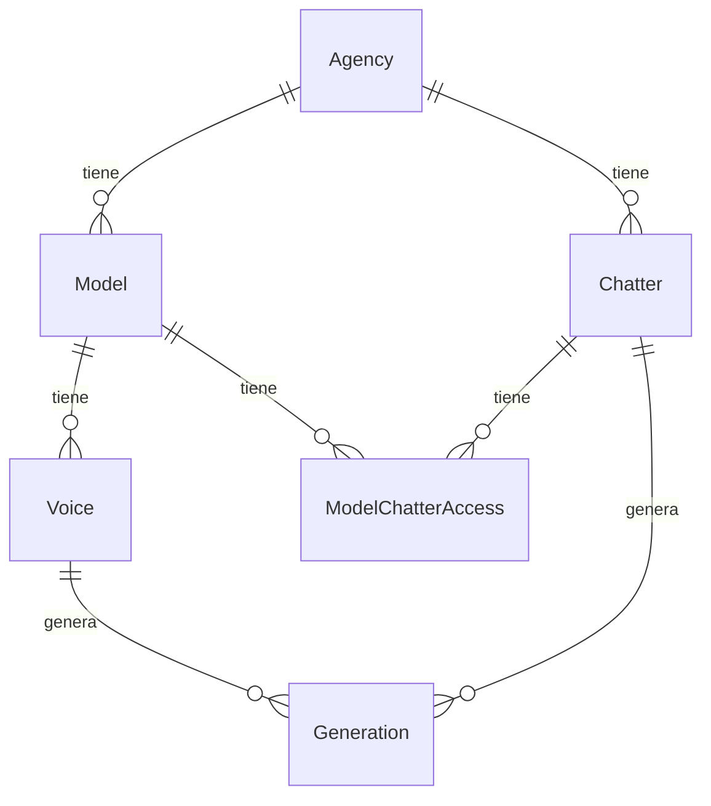

# Esquema de datos objetivo

Este documento describe el esquema de datos del sistema objetivo.
El esquema está simplificado.
La implementación real se define con Prisma en PostgreSQL.

## Convenciones de datos

El proyecto sigue convenciones fijas.
Las mismas convenciones se usan en otros proyectos del equipo.

| Elemento | Convención | Ejemplo |
|---|---|---|
| Modelo Prisma | Singular, PascalCase | `Model`, `Voice` |
| Tabla | snake_case, plural, `@@map` | `models`, `model_chatter_access` |
| Columna | snake_case, `@map` | `elevenlabs_voice_id`, `created_at` |
| Clave foránea | `modelo_id` | `agency_id`, `model_id` |
| Timestamps | `created_at` con `@default(now())` | — |
| Cantidades | `Decimal(12, 2)` | — |
| Estados | Enum, no string | `VoiceStatus`, `ChatterRole` |
| Valores de enum | snake_case | `en_preparacion`, `lista` |

## Diagrama

## Entidades

### Agency

Representa una agencia.
Tabla: `agencies`.

| Campo | Tipo | Nota |
|---|---|---|
| id | Int | Clave primaria. |
| name | String | Nombre de la agencia. |

### Model

Representa una modelo de OnlyFans.
Tabla: `models`.

| Campo | Tipo | Nota |
|---|---|---|
| id | Int | Clave primaria. |
| agency_id | FK | Pertenece a una agencia. |
| name | String | Nombre de la modelo. |

### Voice

Representa una voz clonada.
Tabla: `voices`.

| Campo | Tipo | Nota |
|---|---|---|
| id | Int | Clave primaria. |
| model_id | FK | Pertenece a una modelo. |
| elevenlabs_voice_id | String | Identificador en ElevenLabs. |
| status | Enum | Estado de la voz. |

### Chatter

Representa una chatter.
Tabla: `chatters`.

| Campo | Tipo | Nota |
|---|---|---|
| id | Int | Clave primaria. |
| agency_id | FK | Pertenece a una agencia. |
| role | Enum | Rol de la chatter. |
| name | String | Nombre de la chatter. |
| daily_char_limit | Int | Límite diario de caracteres. |

### ModelChatterAccess

Conecta una chatter con una modelo.
La relación es de muchos a muchos.
Tabla: `model_chatter_access`.

| Campo | Tipo | Nota |
|---|---|---|
| id | Int | Clave primaria. |
| chatter_id | FK | Chatter con acceso. |
| model_id | FK | Modelo asignada. |

### Generation

Representa una generación de audio.
Tabla: `generations`.

| Campo | Tipo | Nota |
|---|---|---|
| id | Int | Clave primaria. |
| chatter_id | FK | Chatter que generó. |
| voice_id | FK | Voz usada. |
| text | String | Texto convertido. |
| audio_url | String | Ubicación del audio. |
| char_count | Int | Cantidad de caracteres. |
| from_cache | Boolean | Si vino de la caché. |
| created_at | Timestamp | Fecha de creación. |

### Phrase

Representa una frase pre-armada.
Tabla: `phrases`.

| Campo | Tipo | Nota |
|---|---|---|
| id | Int | Clave primaria. |
| label | String | Etiqueta de la frase. |
| text | String | Texto de la frase. |

### AudioCache

Cachea los audios generados.
Evita pagar dos veces al proveedor por la misma frase.
Tabla: `audio_cache`.

| Campo | Tipo | Nota |
|---|---|---|
| id | Int | Clave primaria. |
| model_id | FK | Modelo de la frase. |
| text_hash | String | Hash del texto. |
| text | String | Texto original. |
| file_path | String | Ruta del archivo. |
| char_count | Int | Cantidad de caracteres. |
| hits | Int | Cantidad de usos. |
| created_at | Timestamp | Fecha de creación. |

### ModelConsent

Representa el consentimiento de una modelo.
La generación de audio lo exige.
Tabla: `model_consent`.

| Campo | Tipo | Nota |
|---|---|---|
| id | Int | Clave primaria. |
| model_id | FK | Modelo con consentimiento. |
| signed_document_path | String | Ruta del documento firmado. |
| verification_audio_path | String | Ruta del audio de verificación. |
| consented_at | Timestamp | Fecha del consentimiento. |
| commercial_use | Boolean | Uso comercial permitido. |
| notes | String | Notas. |

## Enums

| Enum | Valores |
|---|---|
| ChatterRole | `admin`, `manager`, `chatter` |
| VoiceStatus | `en_preparacion`, `lista`, `fallida` |

## Mapeo desde el esquema actual

| Esquema actual (SQLite) | Esquema objetivo (PostgreSQL) |
|---|---|
| `models` | `Model` (tabla `models`) |
| `model_consent` | `ModelConsent` (tabla `model_consent`) |
| `chatters` | `Chatter` (tabla `chatters`) |
| `models.voice_id` | `Voice` (tabla `voices`, entidad separada) |
| `usage_log` | `Generation` (tabla `generations`) |
| `audio_cache` | `AudioCache` (tabla `audio_cache`) |
| `phrases` | `Phrase` (tabla `phrases`) |
| — | `Agency` (nueva) |
| — | `ModelChatterAccess` (nueva) |
