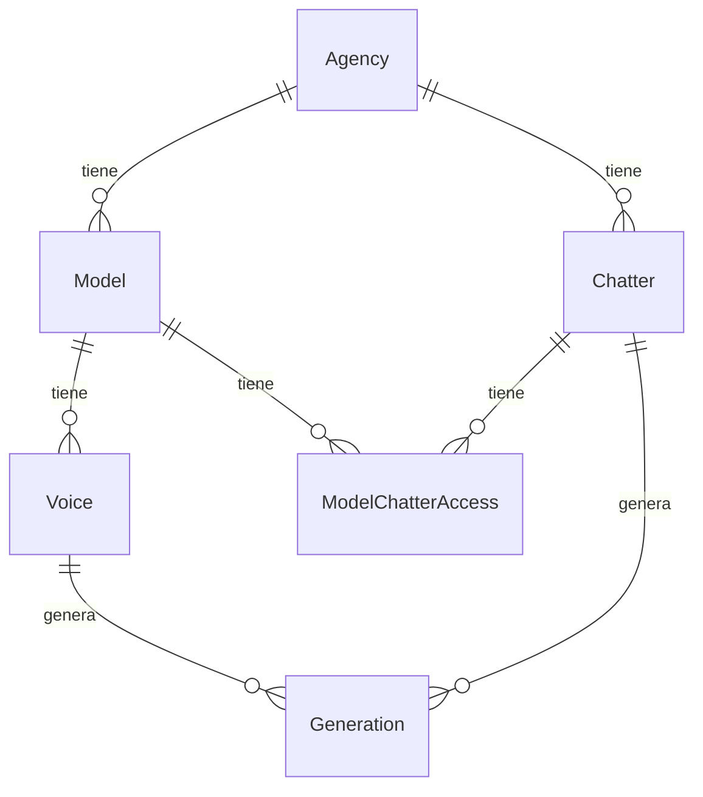

# Esquema de datos objetivo

Este documento describe el esquema de datos del sistema objetivo.
El esquema está simplificado.
La implementación real se define con Prisma en PostgreSQL.

## Diagrama

## Entidades

### Agency

Representa una agencia.

| Campo | Tipo | Nota |
|---|---|---|
| id | ID | Clave primaria. |
| name | String | Nombre de la agencia. |

### Model

Representa una modelo de OnlyFans.

| Campo | Tipo | Nota |
|---|---|---|
| id | ID | Clave primaria. |
| agency_id | FK | Pertenece a una agencia. |
| name | String | Nombre de la modelo. |

### Voice

Representa una voz clonada.

| Campo | Tipo | Nota |
|---|---|---|
| id | ID | Clave primaria. |
| model_id | FK | Pertenece a una modelo. |
| elevenlabs_voice_id | String | Identificador en ElevenLabs. |
| status | Enum | Estado de la voz. |

### Chatter

Representa una chatter.

| Campo | Tipo | Nota |
|---|---|---|
| id | ID | Clave primaria. |
| agency_id | FK | Pertenece a una agencia. |
| role | Enum | Rol de la chatter. |
| name | String | Nombre de la chatter. |

### ModelChatterAccess

Conecta una chatter con una modelo.
La relación es de muchos a muchos.

| Campo | Tipo | Nota |
|---|---|---|
| id | ID | Clave primaria. |
| chatter_id | FK | Chatter con acceso. |
| model_id | FK | Modelo asignada. |

### Generation

Representa una generación de audio.

| Campo | Tipo | Nota |
|---|---|---|
| id | ID | Clave primaria. |
| chatter_id | FK | Chatter que generó. |
| voice_id | FK | Voz usada. |
| text | String | Texto convertido. |
| audio_url | String | Ubicación del audio. |
| char_count | Int | Cantidad de caracteres. |
| created_at | Timestamp | Fecha de creación. |

## Mapeo desde el esquema actual

| Esquema actual (SQLite) | Esquema objetivo (PostgreSQL) |
|---|---|
| `models` | `Model` |
| `model_consent` | Campo o entidad dentro de `Model` |
| `chatters` | `Chatter` |
| `models.voice_id` | `Voice` (entidad separada) |
| `usage_log` | `Generation` |
| — | `Agency` (nueva) |
| — | `ModelChatterAccess` (nueva) |
